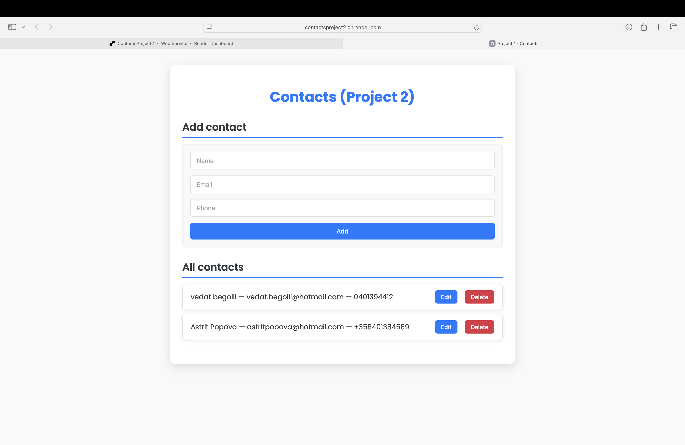
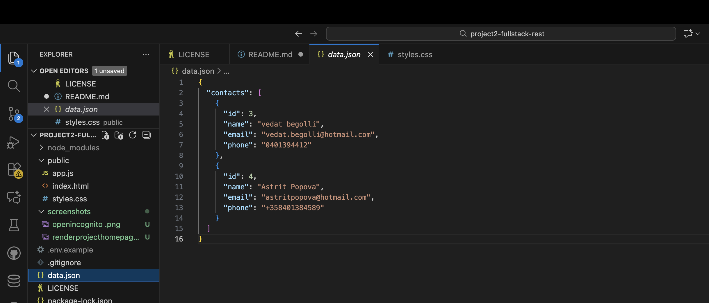

# Contacts App (Project 2)
**Live version:** https://contactsproject2.onrender.com  
**Repository:** https://github.com/VBE1994/ContactsProject2

## Overview
This project is a small full-stack contacts application built with Node.js, Express and a simple frontend. Users can add, edit and delete contacts. Data is stored in a local `data.json` file, which keeps the project simple and suitable for coursework. The UI has been redesigned to a clean, centered card layout.

## Features
- Add new contacts (name, email, phone)
- Edit existing contacts
- Delete contacts
- Updated, modern UI
- REST API (Express)
- File-based storage (`data.json`)

## Run locally
Clone the project and start the server:
```bash
git clone https://github.com/VBE1994/ContactsProject2
cd ContactsProject2
npm install
```
3. Start
```bash
npm start
```
Open http://localhost:3000 in your browser.

## Run in development (optional)
```bash
npm run dev
Deployment (Render)
Push the project to GitHub
Go to Render → New → Web Service
Select your repository
Build command: npm install
Start command: npm start
Deploy and copy the public URL

## Screenshots

### Homepage (Render deployment)


### Data.json view in VS Code


### Testing the app in Incognito

